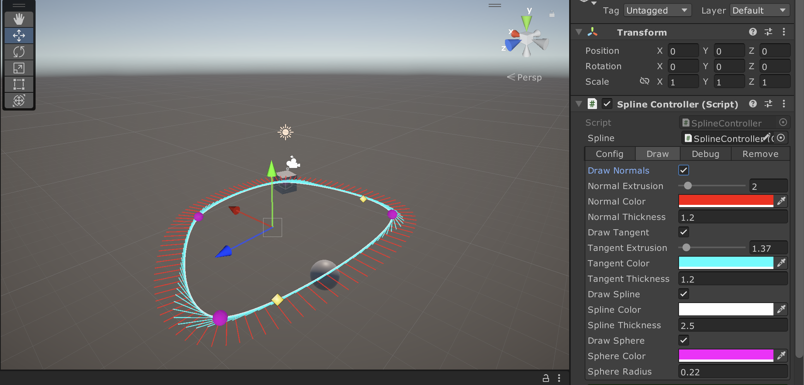
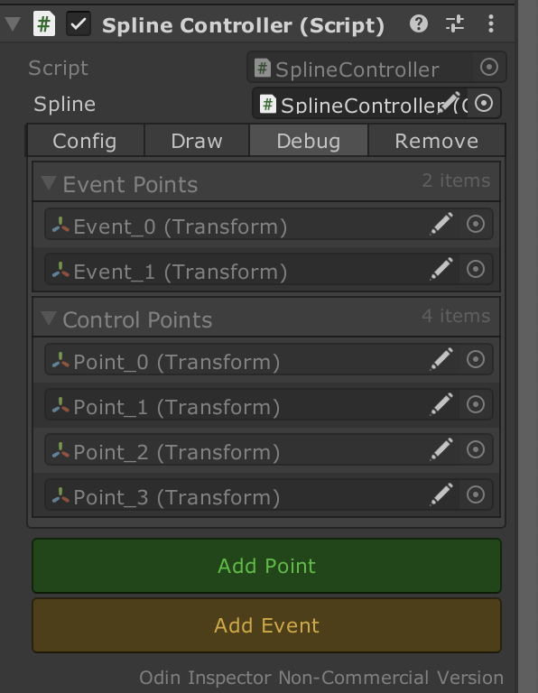
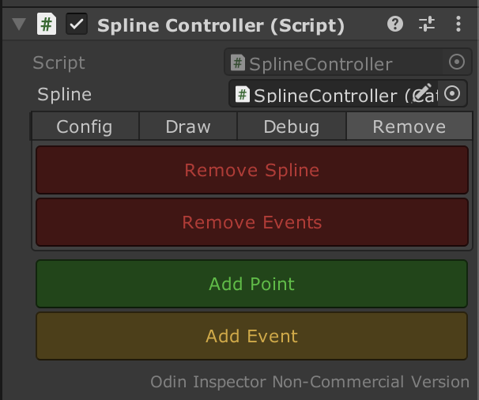
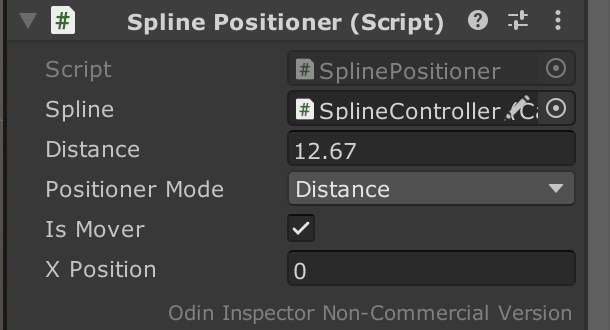
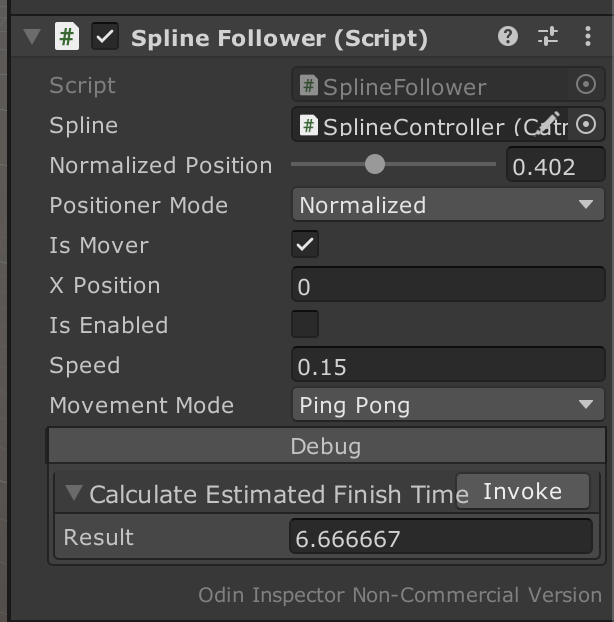

# Spline Editor

### Table of Contents
- [To Do](#to-do)
- [Introduction](#introduction)
- [Requirements](#requirements)
- [Features](#features)

## To Do
- [ ] Mesh generation using Spline

## Introduction
There are a lot of spline editor examples for Unity editor. Because it is a very good practice to learn about computer graphics topic of spline. I used Hermite Curve calculation for this spline editor. In this project, unlike the others, I tried to write as cleanly as possible and added different features.

## Requirements
Unity Editor Version (It may not work in lower versions.)

    2021.2.14f1
    
Odin Inspector (You should add your Odin Inspector to project because of licence issues)
    
## Features
In general, my spline editor has a necessary spline feautures. It has spline controller, clickable points (also spline points and event points exist in hierarchy), spline follower, spline positioner and spline event.

### Spline Controller
Spline controller is a controller of the spline. It comes with Catmull Rom component. You can add points, add events, configure spline and remove it using this component.

#### Config Page

- **Update Method**: Update spline points on update or with a method to call when you want to update spline.
- **Resolution**: Smoothness configuration of spline. When it is high, there are more points than lower version between two main spline points.
- **Closed Loop**: Connect last spline point to first spline point.
- **Point Direction**: Add point direction helper. (When XZ is selected, new point will be spawn to added Z axis point.)

#### Draw Page

- **Draw Checkboxes**: Activate or deactivate drawing.
- **Spline Sphere**: Spline points.
- **Tangent**: Direction of spline.
- **Normal**: Local X axis of spline.
- **Extrusion**: Frequency of drawing.
- **Thickness**: Thickness of drawing.

#### Debug Page

- **Event Points**: List of event points on spline.
- **Spline Points**: List of spline points.

#### Remove Page

- **Remove Spline**: Remove function to remove all spline points.
- **Remove Events**: Remove event points on spline.

### Spline Positioner

- **Positioner Mode**: It has two option to calculate points on spline.
    - **Normalized**: Calculates position from 0 to 1.
    - **Distance**: Calculates position in meters.

- **IsMover**: If you want to affect different gameobject, remove checkbox and add your transform of gameobject.
- **XPosition**: Change local x position on spline. 

### Spline Follower

It inherited from Spline Positioner, same configurations exist with it. Extras:
- **Is Enabled**: Activate or deactivate movement.
- **Speed**: Speed of the movement. Be careful with the positioner mode, speed works according to what did you choose.
- **Movement Mode**: These are movement modes.
    - **Default**: It goes beginning to end and stops.
    - **Forward Loop**: It goes beginning to end and again same loop. It works well with closed loop spline.
    - **Ping Pong**: It goes beginning to end and reverse the movement.
- **Calculate Estimated Finish Time**: Calculate estimated finish time using current speed of follower. It can make level designers happy :D

IN PROCESS...
