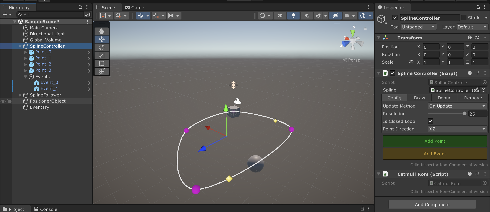
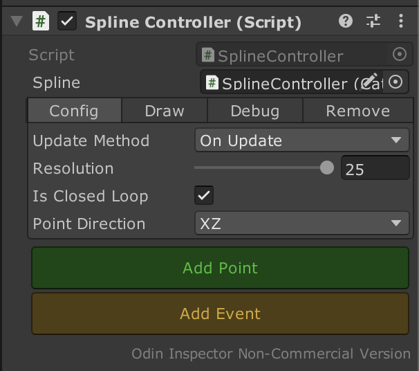

# Spline Editor

### Table of Contents
- [To Do](#to-do)
- [Introduction](#introduction)
- [Requirements](#requirements)
- [Features](#features)

## To Do
- [ ] Mesh generation using Spline

## Introduction
There are a lot of spline editor examples for Unity editor. Because it is a very good practice to learn about computer graphics topic of spline. I used Hermite Curve calculation for this spline editor. In this project, unlike the others, I tried to write as cleanly as possible and added different features.

## Requirements
Unity Editor Version (It may not work in lower versions.)

    2021.2.14f1
    
Odin Inspector (You should add your Odin Inspector to project because of licence issues)
    
## Features
In general, my spline editor has a necessary spline feautures. It has spline controller, clickable points (also spline points and event points exist in hierarchy), spline follower, spline positioner and spline event.

### Spline Controller
Spline controller is a controller of the spline. It comes with Catmull Rom component. You can add points, add events, configure spline and remove it using this component.

- **Update Method**: Update spline points on update or with a method to call when you want to update spline.
- **Resolution**: Smoothness configuration of spline. When it is high, there are more points than lower version between two main spline points.
- **Closed Loop**: Connect last spline point to first spline point.
- **Point Direction**: Add point direction helper. (When XZ is selected, new point will be spawn to added Z axis point.)

IN PROCESS...
